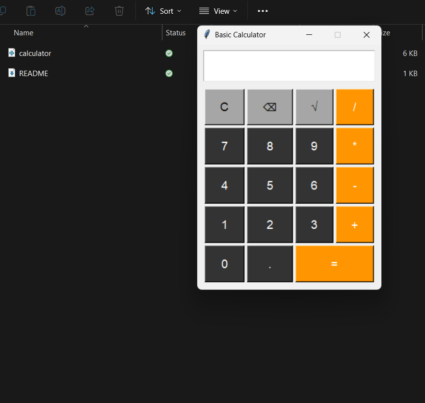
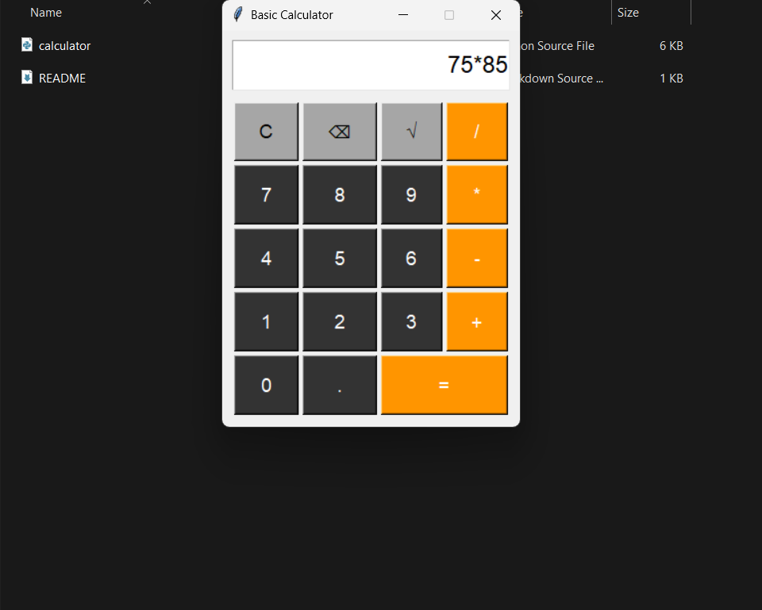
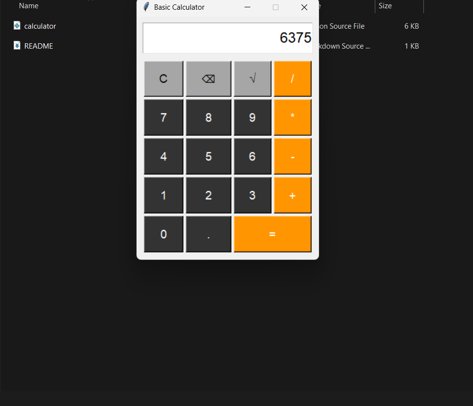

Basic Calculator App
A simple calculator application built with Python and Tkinter.

Features:  
Basic arithmetic operations (addition, subtraction, multiplication, division)  
Square root calculation  
Clear and backspace functionality  
User-friendly GUI interface  
Error handling for invalid operations

Requirements

Python 3.6 or higher
Tkinter (usually comes pre-installed with Python)

